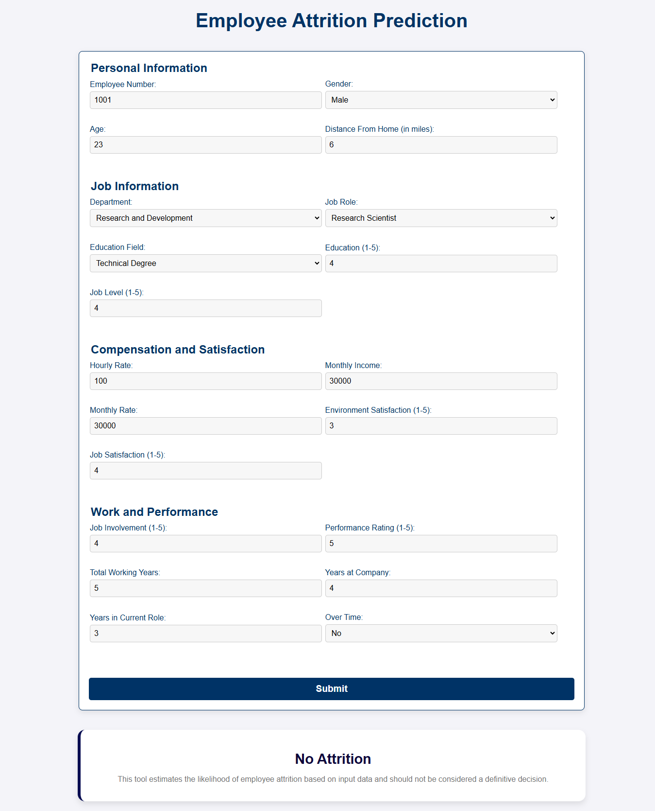

# Employee Attrition Prediction

The Employee Attrition Prediction System uses machine learning and statistical analysis to predict employee turnover. Designed for HR professionals, it facilitates proactive decision-making to reduce attrition and enhance workforce management strategies.

## Technologies Used

- **Backend**: Flask (Python)
- **Frontend**: HTML5, CSS3, JavaScript
- **Containerization**: Docker
- **Machine Learning**: Scikit-learn, XGBoost, Scipy, Seaborn, Matplotlib, Pandas, NumPy 

## Application Demo



## Installation

### Prerequisites

Ensure the following are installed on your local machine:
- Python 3.8+
- Docker (optional for containerized deployment)

### Clone the Repository

```bash
git clone git@github.com:abdullahashfaq-ds/Employee-Attrition-Prediction.git
cd Employee-Attrition-Prediction
```

### Method 01: Virtual Environment Setup

```bash
python -m venv venv
# On Windows, use:
venv\Scripts\activate
# On Linux/MacOS, use:
source venv/bin/activate
# To set up the production environment:
pip install -r requirements.txt
# To set up the development environment:
pip install -r requirements.dev.txt
# To run the project:
python app.py
```

### Method 02: Docker Setup

For a containerized environment, build and run the container:

```bash
docker build -t employee-attrition .  
docker run -p 5000:5000 employee-attrition
```

Access the application at `http://localhost:5000`

## License

This project is licensed under the MIT License. See the [LICENSE](LICENSE) file for more details.

## Contact

For inquiries or support, please open an issue on GitHub or contact [abdullahashfaq.ds@gmail.com](mailto:abdullahashfaq.ds@gmail.com).
